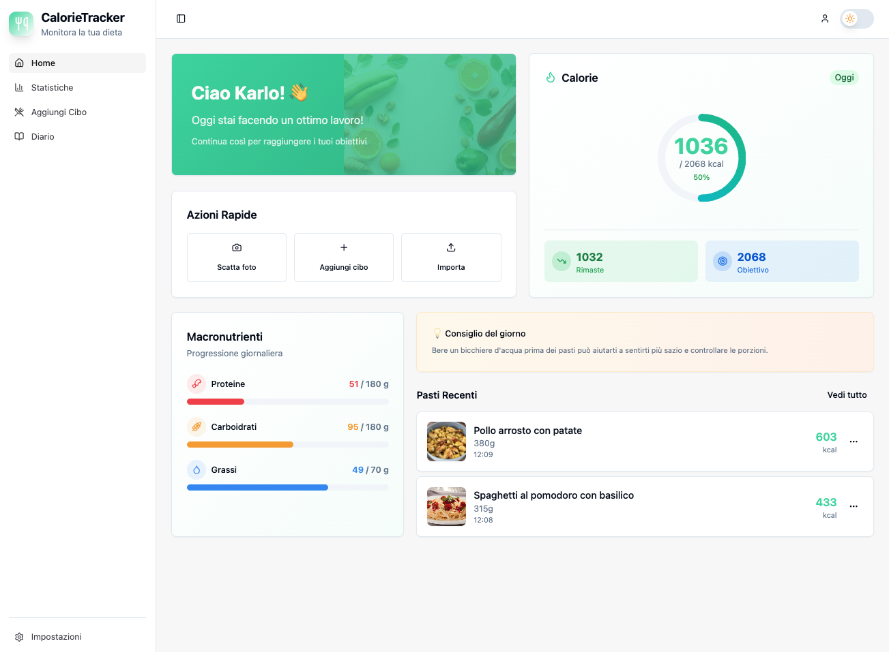
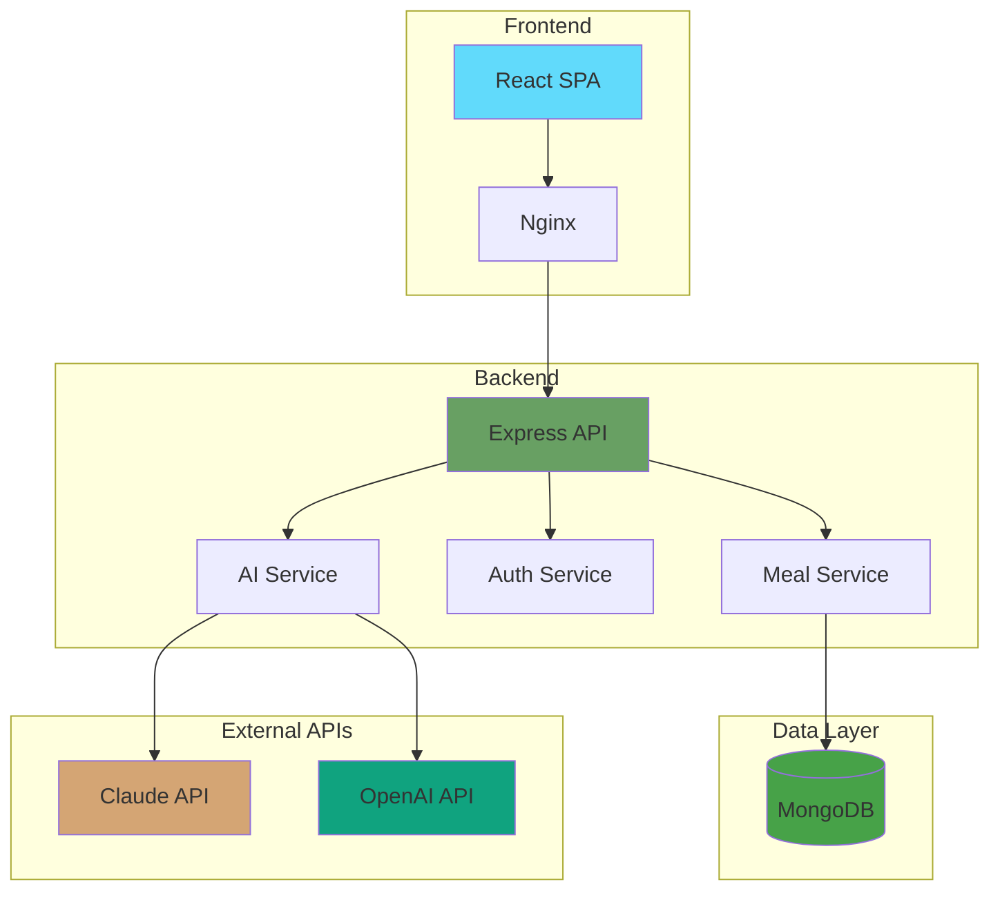
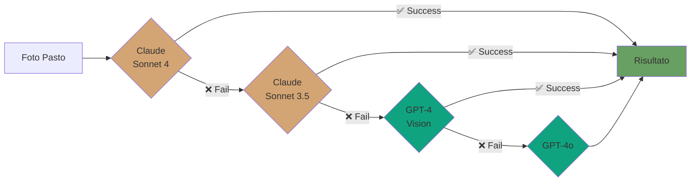

<div align="center">

# 🍽️ CalorieSnap AI

### Traccia le tue calorie con l'intelligenza artificiale

**Scatta, Analizza, Traccia** - La tua app per il controllo calorico intelligente

[](https://github.com/tuousername/calorie-snap-ai)
[](https://nodejs.org)
[](https://react.dev)
[](https://www.typescriptlang.org/)
[](LICENSE)

[📸 Demo](#-demo) • [✨ Features](#-caratteristiche-principali) • [🚀 Quick Start](#-quick-start) • [📚 Docs](#-documentazione) • [🤝 Contributing](#-contribuire)

---

<!-- Aggiungi qui uno screenshot/GIF della dashboard principale -->


</div>

## ✨ Caratteristiche Principali

<table>
<tr>
<td width="50%">

### 📸 Analisi AI Automatica
Scatta una foto del tuo pasto e lascia che l'AI faccia il resto. Riconoscimento automatico di cibi, ingredienti e calcolo nutrizionale preciso.

**Tecnologie:**
- Claude Sonnet 4 (Anthropic)
- GPT-4 Vision (OpenAI)
- Fallback automatico multi-modello

</td>
<td width="50%">

<!-- Aggiungi qui GIF/screenshot dell'analisi AI -->


</td>
</tr>

<tr>
<td width="50%">

<!-- Aggiungi qui GIF/screenshot della dashboard -->


</td>
<td width="50%">

### 📊 Dashboard Intelligente
Monitora il tuo progresso con grafici intuitivi, statistiche dettagliate e insights personalizzati sul tuo apporto calorico giornaliero.

**Include:**
- Calorie consumate vs target
- Macronutrienti (proteine, carbs, grassi)
- Streak days attivi
- Grafici settimanali

</td>
</tr>

<tr>
<td width="50%">

### 📖 Diario Alimentare Completo
Naviga facilmente tra i giorni, visualizza tutti i tuoi pasti organizzati per tipo (colazione, pranzo, cena, snack) e modifica o elimina voci in un click.

**Funzionalità:**
- Navigazione temporale
- Raggruppamento per pasto
- Modifica rapida
- Foto dei pasti

</td>
<td width="50%">

<!-- Aggiungi qui GIF/screenshot del diario -->


</td>
</tr>

<tr>
<td width="50%">

<!-- Aggiungi qui screenshot del dark mode -->


</td>
<td width="50%">

### 🌗 Design Moderno
Interfaccia pulita e moderna con dark mode, animazioni fluide e design responsive. Funziona perfettamente su qualsiasi dispositivo.

**Highlights:**
- Dark/Light mode con persistenza
- Animazioni smooth
- Mobile-first design
- Accessibilità WCAG

</td>
</tr>
</table>

### 🚀 Altre Features

- 🎯 **Obiettivi Personalizzati** - Target calorico basato su età, peso, altezza e livello di attività
- 👤 **Profilo Completo** - Gestione dati antropometrici e preferenze
- 🔐 **Sicurezza First** - Autenticazione JWT, password hash con bcrypt
- ⚡ **Performance** - Lazy loading, code splitting, cache intelligente
- 🐳 **Production Ready** - Deploy con Docker in un comando

---

## 🏗️ Architettura

<div align="center">



</div>

### 🛠️ Stack Tecnologico

<table>
<tr>
<td align="center" width="33%">

### Frontend


**Libraries:**
- React Router v6
- TanStack Query
- shadcn/ui
- next-themes
- date-fns
- Zod validation

</td>
<td align="center" width="33%">

### Backend


**Libraries:**
- Mongoose ODM
- JWT Auth
- bcryptjs
- Anthropic SDK
- OpenAI SDK
- CORS

</td>
<td align="center" width="33%">

### Infrastructure


**DevOps:**
- Docker Compose
- Multi-stage builds
- Health checks
- Volume persistence
- Nginx reverse proxy

</td>
</tr>
</table>

### 📁 Struttura del Progetto

<details>
<summary>Clicca per espandere la struttura completa</summary>

```
calorie-snap-ai/
├── 📂 backend/                  # API Node.js/Express
│   ├── 📂 config/              # Database & AI client config
│   │   ├── database.js         # MongoDB connection
│   │   ├── anthropic.js        # Claude API client
│   │   └── openai.js           # OpenAI client
│   ├── 📂 controllers/         # MVC Controllers
│   │   ├── authController.js   # Authentication logic
│   │   ├── mealController.js   # Meals CRUD operations
│   │   └── userController.js   # User management
│   ├── 📂 middlewares/         # Express middlewares
│   │   ├── auth.js             # JWT verification
│   │   └── errorHandler.js     # Global error handling
│   ├── 📂 models/              # Mongoose schemas
│   │   ├── User.js             # User model
│   │   └── Meal.js             # Meal model
│   ├── 📂 routes/              # API routes
│   │   └── routes.js           # All API endpoints
│   ├── 📂 services/            # Business logic
│   │   ├── aiService.js        # Multi-model AI service
│   │   └── nutritionService.js # Nutrition calculations
│   ├── 🐳 Dockerfile           # Backend container
│   ├── 📄 .env.example         # Environment template
│   └── 🚀 server.js            # Application entry point
│
├── 📂 frontend/                 # React SPA
│   ├── 📂 src/
│   │   ├── 📂 components/      # React components
│   │   │   ├── ui/            # shadcn/ui components
│   │   │   ├── FoodCard/      # Meal display card
│   │   │   ├── CalorieCard/   # Calorie summary card
│   │   │   └── Layout/        # App layout wrapper
│   │   ├── 📂 contexts/        # React contexts
│   │   │   └── AuthContext.tsx # Global auth state
│   │   ├── 📂 hooks/           # Custom React hooks
│   │   │   └── use-toast.ts   # Toast notifications
│   │   ├── 📂 pages/           # Route pages
│   │   │   ├── Home.tsx       # Dashboard
│   │   │   ├── AddFood.tsx    # Add meal (AI/manual)
│   │   │   ├── Diary.tsx      # Food diary
│   │   │   ├── Stats.tsx      # Statistics
│   │   │   ├── Profile.tsx    # User profile
│   │   │   └── Settings.tsx   # App settings
│   │   ├── 📂 services/        # API client services
│   │   │   └── api/           # API endpoints
│   │   └── 📂 types/           # TypeScript definitions
│   ├── 🐳 Dockerfile           # Frontend container
│   ├── 📄 nginx.conf           # Nginx config
│   ├── ⚙️ vite.config.ts       # Vite configuration
│   └── 🎨 tailwind.config.ts   # Tailwind setup
│
├── 🐳 docker-compose.yaml       # Orchestration
├── 📖 README.md                 # This file
├── 📖 DOCKER.md                 # Docker guide
├── 📖 CLAUDE.md                 # AI agent instructions
└── 🔍 docker-validate.sh        # Pre-deployment checker
```

</details>

#### 3️⃣ Apri l'App

Vai su [`http://localhost:8080`](http://localhost:8080) e inizia a usare CalorieSnap AI! 🎉

</details>

---

## 📚 Documentazione

### 🔌 API Endpoints

<details>
<summary><b>Autenticazione</b></summary>

| Metodo | Endpoint | Descrizione | Auth |
|--------|----------|-------------|------|
| `POST` | `/api/auth/register` | Registra nuovo utente | ❌ |
| `POST` | `/api/auth/login` | Login | ❌ |
| `GET` | `/api/auth/me` | Dati utente corrente | ✅ |

**Esempio Request:**
```bash
curl -X POST http://localhost:3000/api/auth/register \
  -H "Content-Type: application/json" \
  -d '{
    "email": "user@example.com",
    "password": "SecurePass123!",
    "name": "Mario Rossi"
  }'
```

</details>

<details>
<summary><b>Pasti & Analisi AI</b></summary>

| Metodo | Endpoint | Descrizione | Auth |
|--------|----------|-------------|------|
| `POST` | `/api/meals` | Crea pasto (con analisi AI) | ✅ |
| `GET` | `/api/meals` | Lista pasti | ✅ |
| `GET` | `/api/meals/today` | Pasti di oggi | ✅ |
| `GET` | `/api/meals/:id` | Dettaglio pasto | ✅ |
| `PUT` | `/api/meals/:id` | Modifica pasto | ✅ |
| `DELETE` | `/api/meals/:id` | Elimina pasto | ✅ |

**Esempio Analisi AI:**
```bash
curl -X POST http://localhost:3000/api/meals \
  -H "Authorization: Bearer YOUR_JWT_TOKEN" \
  -H "Content-Type: application/json" \
  -d '{
    "imageBase64": "data:image/jpeg;base64,/9j/4AAQ...",
    "mealType": "lunch",
    "mediaType": "image/jpeg"
  }'
```

**Response:**
```json
{
  "success": true,
  "data": {
    "dishName": "Spaghetti alla Carbonara",
    "totalCalories": 650,
    "totalWeight": 350,
    "ingredients": [
      { "name": "Spaghetti", "weight": 200, "calories": 310 },
      { "name": "Guanciale", "weight": 100, "calories": 260 },
      { "name": "Uova", "weight": 50, "calories": 80 }
    ],
    "macronutrients": {
      "proteins": 28,
      "carbohydrates": 75,
      "fats": 22
    },
    "confidence": "high"
  }
}
```

</details>

<details>
<summary><b>Statistiche</b></summary>

| Metodo | Endpoint | Descrizione | Auth |
|--------|----------|-------------|------|
| `GET` | `/api/meals/stats/daily` | Statistiche giorno | ✅ |
| `GET` | `/api/meals/stats/weekly` | Statistiche settimana | ✅ |

</details>

<details>
<summary><b>Profilo Utente</b></summary>

| Metodo | Endpoint | Descrizione | Auth |
|--------|----------|-------------|------|
| `GET` | `/api/users/profile` | Profilo utente | ✅ |
| `PUT` | `/api/users/profile` | Aggiorna profilo | ✅ |
| `POST` | `/api/users/onboarding` | Completa onboarding | ✅ |
| `PUT` | `/api/users/settings` | Aggiorna impostazioni | ✅ |

</details>

> 📖 **API Documentation completa:** Vedi `backend/docs/API.md` per tutti gli endpoint e esempi

### 🤖 Sistema AI Multi-Modello

CalorieSnap AI usa un **sistema intelligente di fallback automatico** per garantire alta disponibilità:



**Ordine di Priorità:**

| # | Modello | Provider | Motivo |
|---|---------|----------|--------|
| 1 | Claude Sonnet 4 | Anthropic | 🏆 Migliore per food analysis |
| 2 | Claude Sonnet 3.5 | Anthropic | ⚡ Veloce e affidabile |
| 3 | GPT-4 Vision | OpenAI | 🔄 Fallback alternativo |
| 4 | GPT-4o | OpenAI | 🛡️ Ultima risorsa |

> **Vantaggi:** Se un modello è sovraccarico o non disponibile, il sistema passa automaticamente al successivo, garantendo **99.9% uptime** dell'analisi AI.

**Setup API Keys:**

```env
# Almeno UNA chiave è richiesta
ANTHROPIC_API_KEY=sk-ant-api03-xxx  # 👈 Consigliato
OPENAI_API_KEY=sk-xxx               # Opzionale (fallback)
```

<details>
<summary>📊 Performance Comparison</summary>

| Modello | Accuratezza | Velocità | Costo/1K imgs |
|---------|-------------|----------|---------------|
| Claude Sonnet 4 | ⭐⭐⭐⭐⭐ | 2.5s | ~$15 |
| Claude Sonnet 3.5 | ⭐⭐⭐⭐ | 1.8s | ~$10 |
| GPT-4 Vision | ⭐⭐⭐⭐ | 3.2s | ~$20 |
| GPT-4o | ⭐⭐⭐⭐ | 2.1s | ~$5 |

</details>


<div align="center">

### ⭐ Se CalorieSnap AI ti è utile, lascia una stella!

[](https://github.com/tuousername/calorie-snap-ai)
[](https://github.com/tuousername/calorie-snap-ai/fork)
[](https://github.com/tuousername/calorie-snap-ai)

---

**Made with ❤️, ☕**

*CalorieSnap AI © 2024 - Tutti i diritti riservati*

</div>

