<div align="center">

# 🍽️ CalorieSnap AI

### Traccia le tue calorie con l'intelligenza artificiale

**Scatta, Analizza, Traccia** - La tua app per il controllo calorico intelligente

[](https://github.com/tuousername/calorie-snap-ai)
[](https://nodejs.org)
[](https://react.dev)
[](https://www.typescriptlang.org/)
[](LICENSE)

[📸 Demo](#-demo) • [✨ Features](#-caratteristiche-principali) • [🚀 Quick Start](#-quick-start) • [📚 Docs](#-documentazione) • [🤝 Contributing](#-contribuire)

---

<!-- Aggiungi qui uno screenshot/GIF della dashboard principale -->


</div>

## ✨ Caratteristiche Principali

<table>
<tr>
<td width="50%">

### 📸 Analisi AI Automatica
Scatta una foto del tuo pasto e lascia che l'AI faccia il resto. Riconoscimento automatico di cibi, ingredienti e calcolo nutrizionale preciso.

**Tecnologie:**
- Claude Sonnet 4 (Anthropic)
- GPT-4 Vision (OpenAI)
- Fallback automatico multi-modello

</td>
<td width="50%">

<!-- Aggiungi qui GIF/screenshot dell'analisi AI -->


</td>
</tr>

<tr>
<td width="50%">

<!-- Aggiungi qui GIF/screenshot della dashboard -->


</td>
<td width="50%">

### 📊 Dashboard Intelligente
Monitora il tuo progresso con grafici intuitivi, statistiche dettagliate e insights personalizzati sul tuo apporto calorico giornaliero.

**Include:**
- Calorie consumate vs target
- Macronutrienti (proteine, carbs, grassi)
- Streak days attivi
- Grafici settimanali

</td>
</tr>

<tr>
<td width="50%">

### 📖 Diario Alimentare Completo
Naviga facilmente tra i giorni, visualizza tutti i tuoi pasti organizzati per tipo (colazione, pranzo, cena, snack) e modifica o elimina voci in un click.

**Funzionalità:**
- Navigazione temporale
- Raggruppamento per pasto
- Modifica rapida
- Foto dei pasti

</td>
<td width="50%">

<!-- Aggiungi qui GIF/screenshot del diario -->


</td>
</tr>

<tr>
<td width="50%">

<!-- Aggiungi qui screenshot del dark mode -->


</td>
<td width="50%">

### 🌗 Design Moderno
Interfaccia pulita e moderna con dark mode, animazioni fluide e design responsive. Funziona perfettamente su qualsiasi dispositivo.

**Highlights:**
- Dark/Light mode con persistenza
- Animazioni smooth
- Mobile-first design
- Accessibilità WCAG

</td>
</tr>
</table>

### 🚀 Altre Features

- 🎯 **Obiettivi Personalizzati** - Target calorico basato su età, peso, altezza e livello di attività
- 👤 **Profilo Completo** - Gestione dati antropometrici e preferenze
- 🔐 **Sicurezza First** - Autenticazione JWT, password hash con bcrypt
- ⚡ **Performance** - Lazy loading, code splitting, cache intelligente
- 🐳 **Production Ready** - Deploy con Docker in un comando

---

## 📸 Demo

> **Nota:** Le GIF/screenshot verranno aggiunte nella cartella `docs/images/`

### Screenshots Richiesti

Crea le seguenti immagini e salvale in `docs/images/`:

1. **`dashboard-preview.png`** - Screenshot della dashboard principale (hero image)
2. **`ai-analysis-demo.gif`** - GIF che mostra il processo di analisi AI di un pasto
3. **`dashboard-demo.gif`** - GIF della dashboard con statistiche animate
4. **`diary-demo.gif`** - GIF della navigazione nel diario alimentare
5. **`dark-mode-demo.png`** - Screenshot comparativo light/dark mode
6. **`mobile-responsive.png`** - Screenshot responsive su mobile

---

## 🏗️ Architettura

<div align="center">


</div>

### 🛠️ Stack Tecnologico

<table>
<tr>
<td align="center" width="33%">

### Frontend


**Libraries:**
- React Router v6
- TanStack Query
- shadcn/ui
- next-themes
- date-fns
- Zod validation

</td>
<td align="center" width="33%">

### Backend


**Libraries:**
- Mongoose ODM
- JWT Auth
- bcryptjs
- Anthropic SDK
- OpenAI SDK
- CORS

</td>
<td align="center" width="33%">

### Infrastructure


**DevOps:**
- Docker Compose
- Multi-stage builds
- Health checks
- Volume persistence
- Nginx reverse proxy

</td>
</tr>
</table>

### 📁 Struttura del Progetto

<details>
<summary>Clicca per espandere la struttura completa</summary>

```
calorie-snap-ai/
├── 📂 backend/                  # API Node.js/Express
│   ├── 📂 config/              # Database & AI client config
│   │   ├── database.js         # MongoDB connection
│   │   ├── anthropic.js        # Claude API client
│   │   └── openai.js           # OpenAI client
│   ├── 📂 controllers/         # MVC Controllers
│   │   ├── authController.js   # Authentication logic
│   │   ├── mealController.js   # Meals CRUD operations
│   │   └── userController.js   # User management
│   ├── 📂 middlewares/         # Express middlewares
│   │   ├── auth.js             # JWT verification
│   │   └── errorHandler.js     # Global error handling
│   ├── 📂 models/              # Mongoose schemas
│   │   ├── User.js             # User model
│   │   └── Meal.js             # Meal model
│   ├── 📂 routes/              # API routes
│   │   └── routes.js           # All API endpoints
│   ├── 📂 services/            # Business logic
│   │   ├── aiService.js        # Multi-model AI service
│   │   └── nutritionService.js # Nutrition calculations
│   ├── 🐳 Dockerfile           # Backend container
│   ├── 📄 .env.example         # Environment template
│   └── 🚀 server.js            # Application entry point
│
├── 📂 frontend/                 # React SPA
│   ├── 📂 src/
│   │   ├── 📂 components/      # React components
│   │   │   ├── ui/            # shadcn/ui components
│   │   │   ├── FoodCard/      # Meal display card
│   │   │   ├── CalorieCard/   # Calorie summary card
│   │   │   └── Layout/        # App layout wrapper
│   │   ├── 📂 contexts/        # React contexts
│   │   │   └── AuthContext.tsx # Global auth state
│   │   ├── 📂 hooks/           # Custom React hooks
│   │   │   └── use-toast.ts   # Toast notifications
│   │   ├── 📂 pages/           # Route pages
│   │   │   ├── Home.tsx       # Dashboard
│   │   │   ├── AddFood.tsx    # Add meal (AI/manual)
│   │   │   ├── Diary.tsx      # Food diary
│   │   │   ├── Stats.tsx      # Statistics
│   │   │   ├── Profile.tsx    # User profile
│   │   │   └── Settings.tsx   # App settings
│   │   ├── 📂 services/        # API client services
│   │   │   └── api/           # API endpoints
│   │   └── 📂 types/           # TypeScript definitions
│   ├── 🐳 Dockerfile           # Frontend container
│   ├── 📄 nginx.conf           # Nginx config
│   ├── ⚙️ vite.config.ts       # Vite configuration
│   └── 🎨 tailwind.config.ts   # Tailwind setup
│
├── 🐳 docker-compose.yaml       # Orchestration
├── 📖 README.md                 # This file
├── 📖 DOCKER.md                 # Docker guide
├── 📖 CLAUDE.md                 # AI agent instructions
└── 🔍 docker-validate.sh        # Pre-deployment checker
```

</details>

---

## 🚀 Quick Start

<div align="center">

### Scegli il tuo metodo di setup preferito

[](DOCKER#quick-start)
[](#opzione-2-sviluppo-locale-senza-docker)

</div>

### Prerequisiti

<table>
<tr>
<td>

**Per tutti:**
- 🔑 API Key ([Anthropic](https://console.anthropic.com) o [OpenAI](https://platform.openai.com))

</td>
<td>

**Setup Docker:**
- 🐳 Docker Desktop 20.10+
- 🎵 Docker Compose 2.0+

</td>
<td>

**Setup Locale:**
- 📦 Node.js 20+
- 🗄️ MongoDB 7+
- 📋 npm o yarn

</td>
</tr>
</table>

---

### Opzione 1: 🐳 Deploy con Docker (Consigliato)

> **Perfect for:** Production, testing rapido, deploy completo

```bash
# 1️⃣ Clona il repository
git clone https://github.com/tuousername/calorie-snap-ai.git
cd calorie-snap-ai

# 2️⃣ Configura le variabili d'ambiente
cp backend/.env.example backend/.env

# 3️⃣ Modifica backend/.env e aggiungi la tua API key:
#    ANTHROPIC_API_KEY=sk-ant-api03-xxx  (oppure)
#    OPENAI_API_KEY=sk-xxx

# 4️⃣ Valida la configurazione (opzionale)
./docker-validate.sh

# 5️⃣ Avvia tutto! 🚀
docker-compose up --build
```

<div align="center">

**🎉 Fatto! L'app è live su** [`http://localhost`](http://localhost)

[](http://localhost)

</div>

<details>
<summary>📋 Comandi Docker utili</summary>

```bash
# Avvia in background
docker-compose up -d

# Visualizza i log
docker-compose logs -f

# Ferma tutto
docker-compose down

# Rebuild dopo modifiche
docker-compose up --build

# Reset completo (⚠️ cancella database)
docker-compose down -v
```

</details>

> 📖 **Guida completa:** Vedi [DOCKER.md](DOCKER.md) per troubleshooting e configurazioni avanzate

---

### Opzione 2: 💻 Sviluppo Locale (senza Docker)

> **Perfect for:** Sviluppo, debugging, modifiche al codice

<details>
<summary><b>📖 Espandi per vedere i passaggi</b></summary>

#### 1️⃣ Setup Backend

```bash
# Clona e naviga
git clone https://github.com/tuousername/calorie-snap-ai.git
cd calorie-snap-ai/backend

# Installa dipendenze
npm install

# Configura environment
cp .env.example .env
```

Modifica `backend/.env`:

```env
# Database locale
MONGODB_URI=mongodb://localhost:27017/calorie_snap

# Almeno una API key (consigliato Anthropic)
ANTHROPIC_API_KEY=sk-ant-api03-xxx
# OPENAI_API_KEY=sk-xxx  # Opzionale

# Configurazione server
PORT=3000
NODE_ENV=development
JWT_SECRET=genera_una_chiave_lunga_e_casuale_qui
CORS_ORIGINS=http://localhost:8080,http://localhost:5173
```

```bash
# Avvia il backend
npm start

# ✅ Backend running su http://localhost:3000
```

#### 2️⃣ Setup Frontend

Apri un **nuovo terminale**:

```bash
cd frontend

# Installa dipendenze
npm install

# Avvia dev server
npm run dev

# ✅ Frontend running su http://localhost:8080
```

#### 3️⃣ Apri l'App

Vai su [`http://localhost:8080`](http://localhost:8080) e inizia a usare CalorieSnap AI! 🎉

</details>

---

## 📚 Documentazione

### 🔌 API Endpoints

<details>
<summary><b>Autenticazione</b></summary>

| Metodo | Endpoint | Descrizione | Auth |
|--------|----------|-------------|------|
| `POST` | `/api/auth/register` | Registra nuovo utente | ❌ |
| `POST` | `/api/auth/login` | Login | ❌ |
| `GET` | `/api/auth/me` | Dati utente corrente | ✅ |

**Esempio Request:**
```bash
curl -X POST http://localhost:3000/api/auth/register \
  -H "Content-Type: application/json" \
  -d '{
    "email": "user@example.com",
    "password": "SecurePass123!",
    "name": "Mario Rossi"
  }'
```

</details>

<details>
<summary><b>Pasti & Analisi AI</b></summary>

| Metodo | Endpoint | Descrizione | Auth |
|--------|----------|-------------|------|
| `POST` | `/api/meals` | Crea pasto (con analisi AI) | ✅ |
| `GET` | `/api/meals` | Lista pasti | ✅ |
| `GET` | `/api/meals/today` | Pasti di oggi | ✅ |
| `GET` | `/api/meals/:id` | Dettaglio pasto | ✅ |
| `PUT` | `/api/meals/:id` | Modifica pasto | ✅ |
| `DELETE` | `/api/meals/:id` | Elimina pasto | ✅ |

**Esempio Analisi AI:**
```bash
curl -X POST http://localhost:3000/api/meals \
  -H "Authorization: Bearer YOUR_JWT_TOKEN" \
  -H "Content-Type: application/json" \
  -d '{
    "imageBase64": "data:image/jpeg;base64,/9j/4AAQ...",
    "mealType": "lunch",
    "mediaType": "image/jpeg"
  }'
```

**Response:**
```json
{
  "success": true,
  "data": {
    "dishName": "Spaghetti alla Carbonara",
    "totalCalories": 650,
    "totalWeight": 350,
    "ingredients": [
      { "name": "Spaghetti", "weight": 200, "calories": 310 },
      { "name": "Guanciale", "weight": 100, "calories": 260 },
      { "name": "Uova", "weight": 50, "calories": 80 }
    ],
    "macronutrients": {
      "proteins": 28,
      "carbohydrates": 75,
      "fats": 22
    },
    "confidence": "high"
  }
}
```

</details>

<details>
<summary><b>Statistiche</b></summary>

| Metodo | Endpoint | Descrizione | Auth |
|--------|----------|-------------|------|
| `GET` | `/api/meals/stats/daily` | Statistiche giorno | ✅ |
| `GET` | `/api/meals/stats/weekly` | Statistiche settimana | ✅ |

</details>

<details>
<summary><b>Profilo Utente</b></summary>

| Metodo | Endpoint | Descrizione | Auth |
|--------|----------|-------------|------|
| `GET` | `/api/users/profile` | Profilo utente | ✅ |
| `PUT` | `/api/users/profile` | Aggiorna profilo | ✅ |
| `POST` | `/api/users/onboarding` | Completa onboarding | ✅ |
| `PUT` | `/api/users/settings` | Aggiorna impostazioni | ✅ |

</details>

> 📖 **API Documentation completa:** Vedi `backend/docs/API.md` per tutti gli endpoint e esempi

### 🤖 Sistema AI Multi-Modello

CalorieSnap AI usa un **sistema intelligente di fallback automatico** per garantire alta disponibilità:

```mermaid
flowchart LR
    A[Foto Pasto] --> B{Claude<br/>Sonnet 4}
    B -->|✅ Success| F[Risultato]
    B -->|❌ Fail| C{Claude<br/>Sonnet 3.5}
    C -->|✅ Success| F
    C -->|❌ Fail| D{GPT-4<br/>Vision}
    D -->|✅ Success| F
    D -->|❌ Fail| E{GPT-4o}
    E --> F

    style B fill:#d4a574
    style C fill:#d4a574
    style D fill:#10a37f
    style E fill:#10a37f
    style F fill:#68a063
```



**Ordine di Priorità:**

| # | Modello | Provider | Motivo |
|---|---------|----------|--------|
| 1 | Claude Sonnet 4 | Anthropic | 🏆 Migliore per food analysis |
| 2 | Claude Sonnet 3.5 | Anthropic | ⚡ Veloce e affidabile |
| 3 | GPT-4 Vision | OpenAI | 🔄 Fallback alternativo |
| 4 | GPT-4o | OpenAI | 🛡️ Ultima risorsa |

> **Vantaggi:** Se un modello è sovraccarico o non disponibile, il sistema passa automaticamente al successivo, garantendo **99.9% uptime** dell'analisi AI.

**Setup API Keys:**

```env
# Almeno UNA chiave è richiesta
ANTHROPIC_API_KEY=sk-ant-api03-xxx  # 👈 Consigliato
OPENAI_API_KEY=sk-xxx               # Opzionale (fallback)
```

<details>
<summary>📊 Performance Comparison</summary>

| Modello | Accuratezza | Velocità | Costo/1K imgs |
|---------|-------------|----------|---------------|
| Claude Sonnet 4 | ⭐⭐⭐⭐⭐ | 2.5s | ~$15 |
| Claude Sonnet 3.5 | ⭐⭐⭐⭐ | 1.8s | ~$10 |
| GPT-4 Vision | ⭐⭐⭐⭐ | 3.2s | ~$20 |
| GPT-4o | ⭐⭐⭐⭐ | 2.1s | ~$5 |

</details>

---

### ⚙️ Configurazione Avanzata

<details>
<summary><b>Variabili d'Ambiente Backend</b></summary>

| Variabile | Descrizione | Default | Richiesto |
|-----------|-------------|---------|-----------|
| `MONGODB_URI` | URI connessione MongoDB | - | ✅ |
| `ANTHROPIC_API_KEY` | Anthropic Claude API key | - | ⚠️ Una delle due |
| `OPENAI_API_KEY` | OpenAI API key | - | ⚠️ Una delle due |
| `PORT` | Porta server | `3000` | ❌ |
| `NODE_ENV` | Environment | `development` | ❌ |
| `JWT_SECRET` | Secret per JWT tokens | - | ✅ |
| `CORS_ORIGINS` | Allowed CORS origins | - | ❌ |

</details>

<details>
<summary><b>Personalizzazione Frontend</b></summary>

Modifica `frontend/src/index.css` per customizzare il tema:

```css
:root {
  --primary: 158 64% 52%;        /* Verde principale */
  --accent: 43 96% 56%;          /* Giallo energia */
  --destructive: 0 84.2% 60.2%;  /* Rosso warning */
  /* ... altri colori ... */
}
```

</details>

---

## 🧪 Testing

### Test Backend

```bash
cd backend
npm test
```

### Test Frontend

```bash
cd frontend
npm test
```

### Test End-to-End

```bash
# TODO: Implementare Playwright/Cypress
```

## 🐛 Troubleshooting

### Problema: L'analisi AI fallisce

**Soluzione:**
1. Verifica che almeno una API key sia configurata correttamente
2. Controlla i log del backend: `docker-compose logs backend`
3. Verifica che l'immagine sia in formato supportato (JPEG, PNG, WebP)
4. Assicurati che l'immagine non superi 5MB

### Problema: Frontend non si connette al backend

**Soluzione:**
1. Verifica che il backend sia in esecuzione
2. Controlla `VITE_API_URL` nel file `.env` del frontend
3. Verifica le impostazioni CORS nel backend

### Problema: MongoDB connection failed

**Soluzione:**
1. Verifica che MongoDB sia in esecuzione
2. Controlla `MONGODB_URI` nel `.env`
3. Se usi Docker: `docker-compose logs mongodb`
4. Se locale: `brew services start mongodb-community` (macOS)

Per altri problemi, consulta [DOCKER.md](DOCKER.md) o apri una issue.

## 📈 Roadmap

<table>
<tr>
<td width="33%">

### ✅ v1.0.0 Beta
**Current Release**

- ✅ Autenticazione JWT
- ✅ Analisi AI multi-modello
- ✅ Tracking calorie
- ✅ Dashboard & statistiche
- ✅ Dark/Light mode
- ✅ Docker deploy
- ✅ Responsive design

</td>
<td width="33%">

### 🚧 v1.1.0
**Q1 2025**

- 🔨 Ricette personalizzate
- 🔨 Condivisione pasti
- 🔨 Export PDF report
- 🔨 Notifiche push
- 🔨 Barcode scanner
- 🔨 Water tracking

</td>
<td width="33%">

### 🔮 v2.0.0
**Future**

- 💡 Social features
- 💡 Fitness trackers
- 💡 AI meal suggestions
- 💡 Multi-lingua
- 💡 Offline mode
- 💡 App mobile

</td>
</tr>
</table>

---

## 🤝 Contribuire

<div align="center">

### Aiutaci a migliorare CalorieSnap AI!

[](https://github.com/tuousername/calorie-snap-ai/graphs/contributors)
[](https://github.com/tuousername/calorie-snap-ai/issues)
[](https://github.com/tuousername/calorie-snap-ai/pulls)

</div>

Contributi, issue e feature request sono **molto benvenuti**! 🎉

### Come Contribuire

1. 🍴 **Fork** il progetto
2. 🌿 Crea un branch per la feature:
   ```bash
   git checkout -b feature/AmazingFeature
   ```
3. ✏️ Commit le modifiche:
   ```bash
   git commit -m 'feat: Add some AmazingFeature'
   ```
4. 📤 Push al branch:
   ```bash
   git push origin feature/AmazingFeature
   ```
5. 🔀 Apri una **Pull Request**

### Linee Guida

- Segui il code style esistente
- Scrivi commit messages descrittivi ([Conventional Commits](https://www.conventionalcommits.org/))
- Aggiungi test per nuove features
- Aggiorna la documentazione se necessario

<details>
<summary>📋 Idee per Contributing</summary>

**Good First Issues:**
- 📝 Migliorare documentazione
- 🌐 Tradurre l'interfaccia
- 🎨 Migliorare UI/UX
- 🐛 Fix bug minori

**Feature Ideas:**
- 🍎 Database alimenti personalizzati
- 📊 Nuovi grafici statistiche
- 🔔 Sistema notifiche avanzato
- 🎯 Gamification (achievements, streaks)

</details>

---

## 📄 Licenza

<div align="center">

[](LICENSE)

Questo progetto è distribuito sotto **licenza MIT**.
Vedi il file [LICENSE](LICENSE) per maggiori dettagli.

</div>

---

## 👥 Team

<div align="center">

### Creato e mantenuto da

**[Il Tuo Nome](https://github.com/tuousername)**

[](https://github.com/tuousername)
[](mailto:tuaemail@example.com)
[](https://linkedin.com/in/tuoprofilo)

</div>

---

<div align="center">

### ⭐ Se CalorieSnap AI ti è utile, lascia una stella!

[](https://github.com/tuousername/calorie-snap-ai)
[](https://github.com/tuousername/calorie-snap-ai/fork)
[](https://github.com/tuousername/calorie-snap-ai)

---

**Made with ❤️, ☕**

*CalorieSnap AI © 2024 - Tutti i diritti riservati*

</div>
